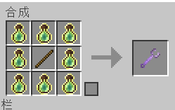

# 🌟 合成配方更改


本页面含有大量图像，请确保您的网络连接通畅


合成配方已迁移至该页面

> 2023.11.20
>
> <mark style="color:orange;">**添加了几种自定义合成配方**</mark>**：**

* 材料：8 金块+1 苹果
* 产物：附魔金苹果

<figure><figcaption></figcaption></figure>

* 材料：4 鹦鹉螺壳+1 下界之星
* 产物：海绵

<figure><figcaption></figcaption></figure>

***

* 材料：3 下界合金碎片+1 鞘翅+1 下界之星
* 产物：2 鞘翅

<figure><figcaption></figcaption></figure>

***

* 材料：9 爆裂紫颂果
* 产物：潜影壳

<figure><figcaption></figcaption></figure>

***

* 材料：9紫水晶块
* 产物：紫水晶母岩

<figure><figcaption></figcaption></figure>

***

> 2024.1.10：
>
> 添加了收纳袋数据包，物品本身类似潜影盒，拥有64个空间，占用1格背包位置，可存放64个可堆叠物品或16个堆叠上限为16的物品或1个不可堆叠物品

* 材料：7 兔子皮 +2 线（原版数据包合成配方）

<figure><figcaption></figcaption></figure>

***

> **2024.1.27:**
>
> 为所有玩家添加了调试棒的使用权限，同时添加了调试棒的合成配方，本意是方便生电/建筑玩家调整部分方块的朝向等属性

* 材料：8 附魔之瓶+1 木棍
* 产物：调试棒

> 调试棒左键某方块时可切换需要修改的方块属性，右键可修改当前选中的属性
>
> <mark style="color:red;">**请勿使用调试棒进行刷物品/修改特殊方块状态等违规操作，一旦发现将收回调试棒使用权限**</mark>

<figure><figcaption></figcaption></figure>

***

> 2024.2.4:
>
> 添加了部分优化合成配方

* 材料：1 金苹果+1 红色染料（无序）
* 产物：苹果

<figure><figcaption></figcaption></figure>

***

* 材料：5 铁锭+1 漏斗
* 产物：漏斗矿车

<figure><figcaption></figcaption></figure>

***

* 材料：5 铁锭+1 箱子
* 产物：箱子矿车

<figure><figcaption></figcaption></figure>

***

* 材料：2 任意种类原木/去皮原木
* 产物：箱子

<figure><figcaption></figcaption></figure>

***

* 材料：8 任意种类原木/去皮原木
* 产物：4 箱子

<figure><figcaption></figcaption></figure>

***

* 材料：4 圆石
* 产物：深板岩圆石

<figure><figcaption></figcaption></figure>

***

* 材料：6 铁锭+1 木板
* 产物：盾牌~~（牌盾）~~

<figure><figcaption></figcaption></figure>

***

* 材料：9 骨头
* 产物：3 骨块

<figure><figcaption></figcaption></figure>

***

* 材料：石英块
* 产物：4 石英

<figure><figcaption></figcaption></figure>

***

* 材料：2 雪球
* 产物：雪

<figure><figcaption></figcaption></figure>

***

* 材料：雪块
* 产物：4 雪球

<figure><figcaption></figcaption></figure>
