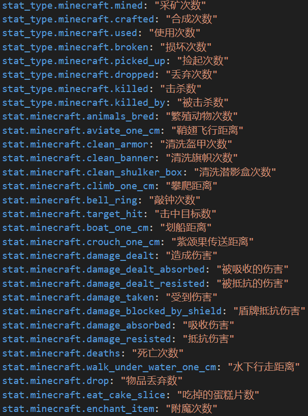
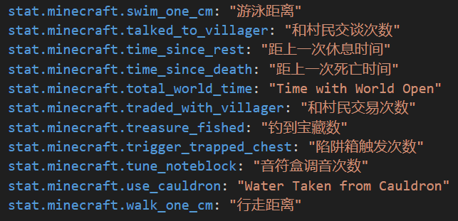
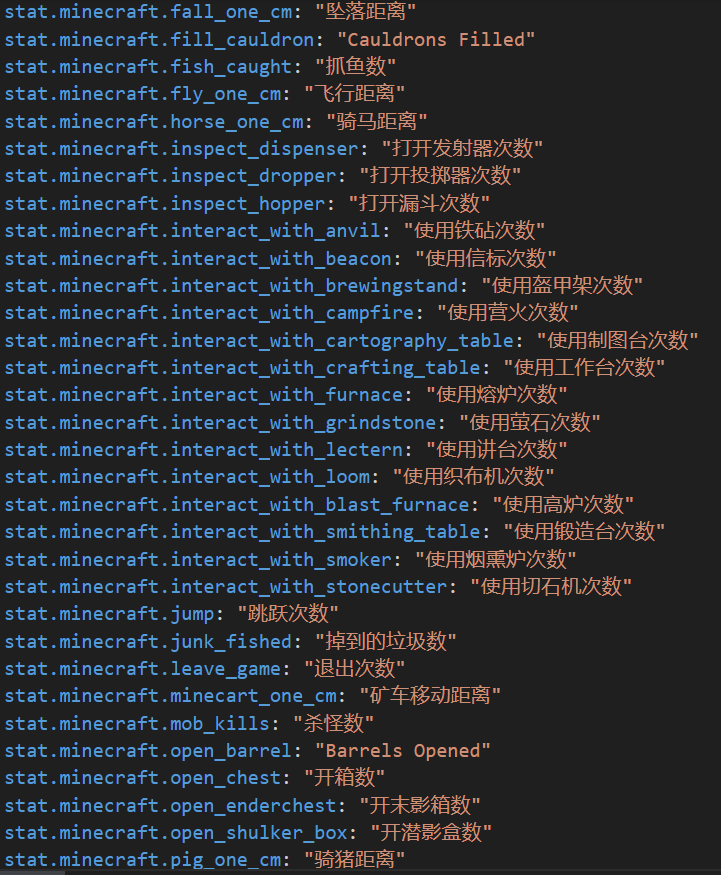

# ☘️ 统计数据

**/stat <统计项>**

输入合法的参数之后会显示排行前十的玩家列表， 点击“share”即可让所有玩家看到排行榜

> 服务端更新到1.20.4之后似乎share按钮没法分享至所有玩家了

可用参数（太多了自己看图吧）：

> 这里的翻译是我手工翻译的，有些东西我也不知道是什么就没翻译，输指令的时候貌似只支持英文参数，建议还是按Tab查看参数列表（有更好的或者补充翻译欢迎联系我更改）
>
> 翻译的结果会显示在share之后的标题

<figure><figcaption></figcaption></figure>

<figure><figcaption></figcaption></figure>

<figure><figcaption></figcaption></figure>
