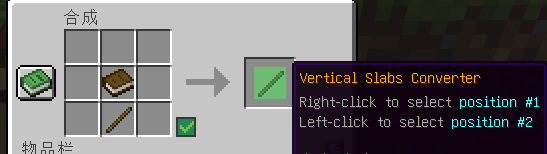

# 📗 可染色展示框，书，收纳袋

<figure><figcaption>
染色的物品展示框（物品模型不影响效果）
</figcaption></figure>

<figure><figcaption>
染色的荧光物品展示框
</figcaption></figure>

是否荧光在显示上无明显区别（左：普通  |  右：荧光）：.png>)

***

<figure><figcaption>
染色的书与笔
</figcaption></figure>

仅支持书与笔合成，署名后保留颜色，不可再次染色

***

<figure><figcaption></figcaption></figure>


<mark style="color:red;">**`请注意，染色将会丢失其中的所有物品`**</mark>


<figure><figcaption></figcaption></figure>

<figure><figcaption>
可互染
</figcaption></figure>
